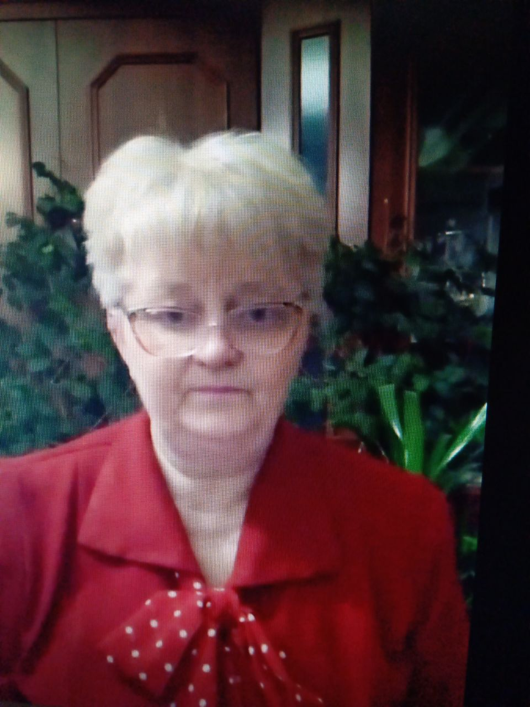

# Suprun Victoriia 

---
## My contacts: 
***phone:*** +380(63)11-36-462
***email:*** v.suprun1961@gmail.com
***Telegram:*** @svictoria1961
***Viber:*** ВИКТОРИЯ
---
## About Me:
I work in a kindergarten as a music director and as an accompanist in the Palace of Children's Creativity.
I am mastering new professions - Web developer and Web designer. I possess such qualities as responsibility, punctuality, attention, organization, conscientiousness, perseverance, striving for professional self-improvement.

---
## Education and work experience:
educational institution | Place of work | Job title | Year
:-----------------------:|:------------------:|:---------:|:---------:
Kharkov Mechanical College| Machine building plant| Technologist| 1978-1981
Music College| Kindergarten| Musical director| 1981-1986
Pedagogical University| Kindergarten| Musical director| 1987-2023
Pedagogical University| Palace of Children's Creativity| Accompanist| 1990-2023

---
## Additional education:
1. Courses in HTML, CSS and JavaScript.     
    1.1 [Certificate](front-end-javascript.jpg)
    1.2 [Certificate](layout.png)
    1.3 [Certificate](javascript.png)  

2. Programming courses for beginners.   [Certificate](programmirovanie.png)
3. Web design courses.   [Certificate](veb-designer.png)
4. Digital design UX/UI.
    4.1 [Certificate](digital-design.png)
    4.2 [Certificate](ux-ui-start.jpeg)

    ---
## My projects: 
* [HTML5, CSS3, JavaScript:](https://viktoriya-s.github.io/music/)
* [HTML5, CSS3](https://viktoriya-s.github.io/resume-new/) 
* [HTML5, CSS3, JavaScript, UX/UI:](https://viktoriya-s.github.io/banderogys/)

---
---
## Languages:
* Ukrainian - native
* Russian - native

